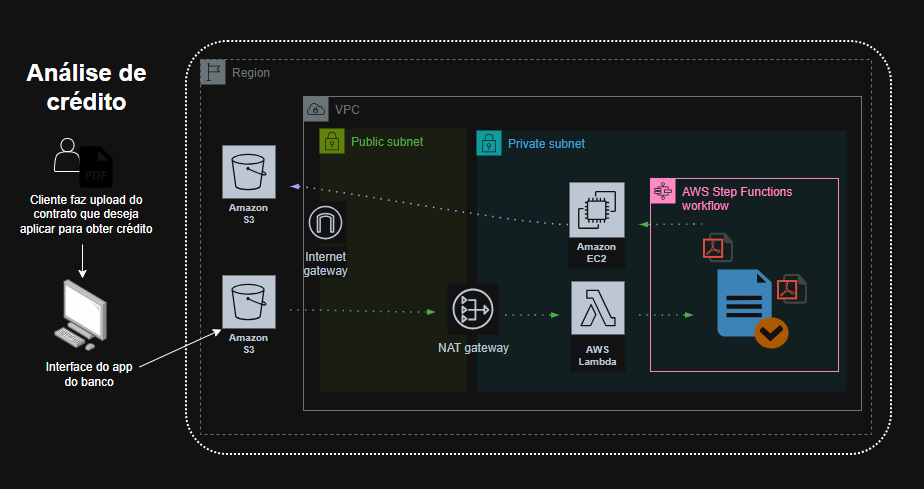

# Projeto de Arquitetura de Nuvem: Análise de Crédito  

## Introdução

Este documento especifica uma arquitetura de nuvem destinada à automação da análise de crédito. O processo tradicionalmente exige intervenção manual para coleta e validação de documentos, o que provoca lentidão e risco de erros. A solução proposta utiliza recursos da AWS para assegurar escalabilidade, segurança e automação, aprimorando a experiência do cliente e a eficiência institucional.

Este trabalho integra o escopo do Bootcamp Code Girls, promovido pela DIO. Objetiva demonstrar como projetar uma solução robusta que processe, analise e valide documentos de forma automatizada, com documentação técnica rigorosa e detalhada.

## Objetivos

Os objetivos consistem em:

- Projetar arquitetura de nuvem adequada a problema complexo de negócio;  
- Documentar processos e fluxos de trabalho com clareza e precisão;  
- Demonstrar uso eficaz de serviços AWS em solução modular, segura e escalável.

## Conhecimentos técnicos aplicados

Este projeto evidencia domínio dos seguintes conceitos:

- Design de soluções em nuvem;  
- Arquitetura serverless e orientada a eventos;  
- Orquestração de workflows com AWS Step Functions;  
- Segurança: redes virtuais (VPC), sub‑redes públicas e privadas, grupos de segurança;  
- Integração entre serviços AWS: S3, Lambda, EC2, Step Functions.

## Metodologia

Elaborou‑se um desenho arquitetônico que responda aos requisitos de negócio com eficiência e resiliência. Princípios de arquitetura da AWS foram aplicados para assegurar modularidade, baixo acoplamento e autonomia entre componentes.

### Diagrama da arquitetura

A imagem a seguir representa a solução proposta para automação da análise de crédito:

### Fluxo de trabalho

1. Cliente realiza upload de documento em bucket no Amazon S3;  
2. Evento no bucket aciona função Lambda;  
3. Lambda inicia workflow no Step Functions;  
4. Workflow invoca tarefas distintas:  
   - funções Lambda para integrações leves;  
   - instância EC2 para processamento intensivo;  
5. Resultado do workflow armazena‑se com segurança;  
6. Notificação encaminha resultado aos sistemas internos relevantes.

## Detalhamento técnico

| Componente | Função | Observações de implantação |
|------------|--------|-----------------------------|
| **Amazon S3** | Armazenamento de documentos de entrada e resultados finais | Dois buckets distintos: entrada (inbound) e resultados (results). Configurar notificação de evento no bucket de entrada para acionar Lambda. |
| **AWS Lambda** | Processamento leve, disparo de workflow | Função principal para disparo do Step Functions; funções auxiliares para chamadas de API e validações simples. |
| **AWS Step Functions** | Orquestração das etapas do processo | Máquina de estados com definição clara de tarefas, tratamento de falhas e branches de fluxo. |
| **Amazon EC2** | Processamentos pesados (scoring, análise de dados) | Executar em sub‑rede privada; alocar recursos conforme carga; garantir segurança de acesso. |
| **VPC, Subnets e Security Groups** | Proteção da infraestrutura | Sub‑redes públicas para recursos que demandem acesso externo; privadas para instâncias sensíveis; grupos de segurança restritivos; isolamento mínimo necessário. |

## Segurança e redes

A arquitetura deve obedecer aos seguintes critérios de segurança:

- Separação entre rede pública e privada;  
- Controle de tráfego por grupos de segurança;  
- Visibilidade mínima de recursos críticos para a internet;  
- Criptografia de dados em trânsito e em repouso;  
- Políticas de IAM (Identity and Access Management) com princípio de menor privilégio.

## Conclusão

A solução proposta traduz problema de negócio em arquitetura técnica viável, segura e escalável. O uso de serviços gerenciados favorece manutenção reduzida. A separação clara de componentes possibilita evolução futura sem comprometimento do sistema.  
